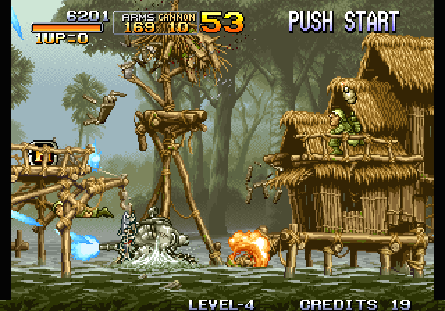

# neogeorecomp

**A static-recompilation toolkit for SNK Neo Geo (MVS/AES) games: it turns a game's 68000 program into C and runs it natively against a model of the Neo Geo board.**

The game code is not interpreted. `m68krecomp` translates it ahead of time into readable C, one routine per entry point, and the runtime supplies everything the 68000 talked to: the video chip, palette, I/O, the Z80 sound CPU and the MVS system ROM, which boots the game exactly as a real cabinet does.

Games live in their own repos and pull this one in as a submodule:

- [**metalslug**](https://github.com/sp00nznet/metalslug): *Metal Slug* (1996), the reference game. It boots, runs attract mode and plays through Mission 1 on 100% recompiled code.
- [**neodriftout**](https://github.com/sp00nznet/neodriftout): *Neo Drift Out*. It was brought up on the previous, title-specific runtime and is not yet ported to this one ([ROADMAP.md](ROADMAP.md)).

> **No game data here.** ROMs, system ROMs and anything generated from them (the recompiled C, entry-point lists) are never committed. You supply your own dump; the recompiler runs locally and writes into your build directory.

## Status

**v0.2.0-dev, alpha.** Metal Slug is playable, with no sound yet.



*Metal Slug running on recompiled 68000 code: the SV-001 in the Mission 1 river village. The screenshot is real output from `--headless --screenshot`.*

| Area | State |
|---|---|
| 68000 recompiler | All 68000 instructions. Discovery covers vectors, call targets, jump tables and data pointers, and an optional profile pass adds entry points only seen at runtime. |
| Correctness | `--verify` re-runs every native block in Musashi and compares registers, flags and bus writes. Metal Slug soak: **14.06M blocks, 0 mismatches.** |
| Conformance | **59/60** of Musashi's 68000 test programs pass recompiled. The reference interpreter also gets 59/60: `move.bin` uses a 68020 addressing mode. |
| Boot | Real MVS system ROM (`sp-s2.sp1`): memory test, eyecatcher, coins and credits, game start. There is no BIOS HLE. |
| Video | Per-scanline sprites (sticky chains, L0-ROM vertical shrink, horizontal shrink, 96-per-line limit, auto-animation), fix layer, both palette banks, raster timer IRQ. |
| I/O | Controllers, coin/service, DIPs, system latch, uPD4990A calendar, backup RAM lock. |
| Audio | The Z80 runs the real sound driver (NMI command latch, reply latch, ROM banking, YM2610 timers). **No sound output yet:** FM/SSG/ADPCM synthesis is next. |
| Platforms | Windows (MSVC 2022) and Linux (gcc), both verified locally; the CI workflow builds both and runs conformance. The SDL2 window is optional; headless builds need nothing extra. |

### Compatibility

| Game | Boots | In game | Native coverage | `--verify` | Sound |
|---|---|---|---|---|---|
| Metal Slug (`mslug`) | yes | yes, Mission 1 played through a 5-minute soak | 100% of that soak after one profile pass | 0 mismatches | no |
| Neo Drift Out (`driftout`) | not yet ported | | | | |

## How it works

```
  your ROM files ──► mslug_recomp (m68krecomp) ──► build/generated/*.c ──┐
   (P ROM + BIOS)     decode, discover, emit C                          │ compiled into
                                                                        ▼
                     neogeorecomp runtime ◄──── the game executable ◄───┘
   dispatcher · Musashi fallback · LSPC video · palette · I/O · Z80/YM2610 · SDL2 or headless
```

Each 68000 routine becomes a C function. Every line carries the original address and disassembly and is lowered to flag-correct helpers. Loop back-edges yield to the scheduler when an event is due. The sample below is from Musashi's `dbcc` test program (MIT), because output generated from a game is never published:

```c
void t_dbcc_r_010040(void) {
    switch (CPU.pc) {                /* entry points: the routine, loop heads, return sites */
    case 0x010040u: goto L_010040;
    case 0x010048u: goto L_010048;
    case 0x01005Au: goto L_01005A;
    default: ng_bad_dispatch(CPU.pc); return;
    }
    ...
L_010040: /* 010040: moveq   #$3, D0 */
    { NG_INSN(4); CPU.d[0] = ng_logic32(0x00000003u); }
L_010042: /* 010042: moveq   #$0, D1 */
    { NG_INSN(4); CPU.d[1] = ng_logic32(0x00000000u); }
L_010044: /* 010044: move    #$0, CCR */
    { NG_INSN(16); uint16_t v = (uint16_t)0x0u; ng_set_ccr(v); }
L_010048: /* 010048: addi.b  #$1, D1 */
    { NG_INSN(8); uint8_t d = (uint8_t)CPU.d[1]; uint8_t r = ng_add8((uint8_t)0x1u, d); CPU.d[1] = (CPU.d[1] & 0xFFFFFF00u) | (uint8_t)(r); }
L_01004C: /* 01004C: dbra    D0, $10048 */
    { NG_INSN(12); if (!CC_F) { uint16_t cnt = (uint16_t)(CPU.d[0] - 1); CPU.d[0] = (CPU.d[0] & 0xFFFF0000u) | (uint16_t)(cnt); if (cnt != 0xFFFF) { ng_cycles -= 2; if (ng_cycles >= ng_next_event) { CPU.pc = 0x010048u; return; } goto L_010048; } } ng_cycles += 2; }
L_010050: /* 010050: cmpi.l  #$4, D1 */
    { NG_INSN(14); uint32_t d = (uint32_t)CPU.d[1]; ng_cmp32((uint32_t)0x4u, d); }
    ...
}
```

Control flow between routines goes through a dispatcher, and return addresses live on the emulated stack. Code that pops or rewrites its return address therefore behaves as on hardware, and interrupts are taken as real 68000 exceptions. Addresses with no recompiled entry run in [Musashi](https://github.com/kstenerud/Musashi), which also acts as the correctness oracle. [docs/recompiler.md](docs/recompiler.md) covers the details.

## Getting started

The toolkit is a library, so you use it through a game repo. The quickest way to see it run is [metalslug's Getting Started](https://github.com/sp00nznet/metalslug#getting-started).

To build the toolkit on its own and run the conformance harness (no game data needed):

1. Install **Git**, **CMake 3.20+** and a C compiler: Visual Studio 2022 with *Desktop development with C++* on Windows, or `gcc` on Linux. SDL2 is optional (vcpkg `sdl2` on Windows, `libsdl2-dev` on Linux).
2. Clone with submodules:
   ```
   git clone --recurse-submodules https://github.com/sp00nznet/neogeorecomp
   cd neogeorecomp
   ```
3. Configure, build and test:
   ```
   cmake -S . -B build
   cmake --build build --config Release
   ctest --test-dir build -C Release --output-on-failure
   ```
   Expected output ends with:
   ```
   100% tests passed, 0 tests failed out of 1
   ```
   To see each program, run the harness directly with `build/Release/ng_conformance --corpus ext/musashi/test/mc68000 -v` (on Linux, `build/ng_conformance`). It ends with `conformance: 59/60 68000 test programs pass recompiled (reference interpreter: 59/60)`.

Common trip-ups:
- *"Submodules missing"*: you cloned without `--recurse-submodules`. Run `git submodule update --init`.
- *SDL2 not found* is only a notice. The build is then headless-only. To get a window on Windows, pass `-DCMAKE_TOOLCHAIN_FILE=<vcpkg>/scripts/buildsystems/vcpkg.cmake` with `sdl2` installed.

## Usage

A game executable built on the toolkit takes these options ([docs/running.md](docs/running.md) has the details):

```
  --rom-path DIR        game ROM files (default: roms)
  --bios-path DIR       system ROM files (default: the ROM path)
  --bios FILE           system ROM (default: sp-s2.sp1, MVS Asia/Europe)
  --headless            no window; run as fast as possible
  --record FILE.mp4     pipe frames to ffmpeg
  --frames N            stop after N frames
  --screenshot N:FILE   save frame N as PNG (repeatable)
  --input FILE          scripted input (see docs/running.md)
  --interp              run everything in the interpreter
  --verify              re-run every recompiled block in the interpreter and compare
  --dump-misses FILE    write interpreted entry points for the recompiler
  --scale N             window scale (default 3)
```

For example, to record a verified headless run:

```
metalslug --headless --verify --frames 1801 --input tests/coin_start.txt --record run.mp4
[neogeorecomp] mslug: 33613 recompiled entry points
[verify] 961369 blocks checked, 0 mismatches
[exec] native blocks 961369, interpreted instructions 0, 0 uncovered entry points
```

## Building from source

See Getting Started above. Build options:

| Option | Default | Effect |
|---|---|---|
| `NEOGEORECOMP_BUILD_TESTS` | on when top-level | Build `ng_conformance` and register it with CTest |
| SDL2 found by `find_package` | optional | Builds the window; without it the runtime is headless-only |

Targets: `neogeorecomp` (the runtime library), `m68krecomp_core` (the recompiler, linked into each game's generator), `m68krecomp` (the standalone tool for flat images), and `ng_conformance`.

## Repository layout

```
include/neogeorecomp/  public API: neogeo.h (game host), cpu.h + bus.h (what generated code uses), recomp.h
src/                   runtime: exec (dispatcher, --verify), cpu, bus, lspc, video, io, audio, platform, window_sdl
tools/m68krecomp/      recompiler: decode, recomp (discovery, output), emit (C lowering), main (raw-image tool)
tests/conformance/     harness.c + BASELINE
ext/                   submodules: Musashi (68000, MIT), superzazu/z80 (MIT)
docs/                  architecture, recompiler, running, conformance, porting a game, hardware notes
```

## Documentation

- [docs/architecture.md](docs/architecture.md): the parts, the timing model, and one frame's data flow
- [docs/recompiler.md](docs/recompiler.md): decoding, discovery, the emitted C, and the execution model
- [docs/running.md](docs/running.md): options, input scripts, headless recording, `--verify`, profiling
- [docs/conformance.md](docs/conformance.md): the harness and how to read its numbers
- [docs/porting-a-game.md](docs/porting-a-game.md): bringing up a new title
- [docs/hardware-notes.md](docs/hardware-notes.md): the details that took the longest to get right
- [ROADMAP.md](ROADMAP.md) · [CHANGELOG.md](CHANGELOG.md) · [CONTRIBUTING.md](CONTRIBUTING.md)

## House style

This repo follows the shared layout of the sp00nznet recomp toolkits (lynxrecomp, snesrecomp, ...): a toolkit repo with game repos consuming it as a submodule; an interpreter kept as the bring-up oracle; a conformance harness in CI; and `--headless --record` on every runner. See [recompclass](https://github.com/sp00nznet/recompclass) for background on static recompilation.

## Contributors

No outside contributions yet. When there are, they will be credited in `CONTRIBUTORS.md`. [CONTRIBUTING.md](CONTRIBUTING.md) explains how to send one.

## Credits

The code is original. It builds on:

- [**Musashi**](https://github.com/kstenerud/Musashi) by Karl Stenerud (MIT): the fallback interpreter, the correctness oracle, the cycle table and the conformance corpus.
- [**superzazu/z80**](https://github.com/superzazu/z80) by Nicolas Allemand (MIT): the Z80 core.
- The [NeoGeo Development Wiki](https://wiki.neogeodev.org/) and MAME's Neo Geo driver, as hardware references (no code copied).

## License

MIT, see [LICENSE](LICENSE). Third-party components keep their own licences, listed in [NOTICE](NOTICE).
